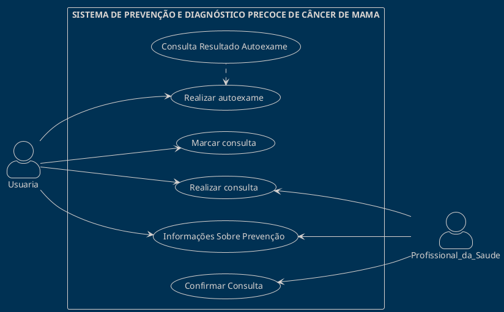

# Sistema ProjMama
<!-- testar o diagrama aqui: http://www.plantuml.com/plantuml/duml/XP1BRl8m58NdNiNv6S4W_mfGHHIYAeC0IcYdw9BSW5N7HhRJHwjEsa4Nq2Lqq1Lq1TbO2Q9CQ67an_q-doEFd2Vhcre9ToFrXYpLeC8Rc_i7nQ0xTgPcyS-lkMOiLSCRAxKNYYiFRs3bQkrHIik5bqQBdOihrv2Lj3_DhAcaSzingKL9YvoQaaLda5ufHYzFydcSXXZ7c6NnTJnftzhNAMACa_1oqhxdyoIQTgDe6iKT5RKlaoZEkcqQfc7lIG3uIKKGNA2VCIdvI1RKUCFtLFEWWtuTOFWV_SXeroXFo7YtbWRXWJX-FoLRa4MnjmOuKU407JE9heojgVrilzWXDqlBc5c-PRsz-Z03iLEwSfNSSXRH8N0O17zyBO3ZzFF6kIud_6SnObqsjVe6 -->

Sobre o projeto (colocar o texto aqui)...

## 1. Diagrama de casos de uso
Realizar Autoexame d Consultar Resultados

## 2. Descrições dos casos de uso

## 3. Modelo de domínio

## 4. Diagramas de sequência

## 5. Diagramas de classes de projeto

