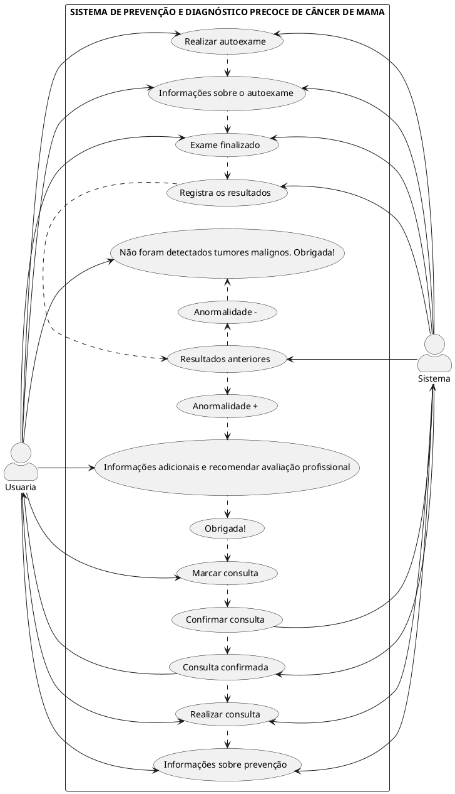

# SISTEMA DE PREVENÇÃO E DIAGNÓSTICO PRECOCE DE CÂNCER DE MAMA
<!-- testar o diagrama aqui: [http://www.plantuml.com/plantuml/duml/XP1BRl8m58NdNiNv6S4W_mfGHHIYAeC0IcYdw9BSW5N7HhRJHwjEsa4Nq2Lqq1Lq1TbO2Q9CQ67an_q-doEFd2Vhcre9ToFrXYpLeC8Rc_i7nQ0xTgPcyS-lkMOiLSCRAxKNYYiFRs3bQkrHIik5bqQBdOihrv2Lj3_DhAcaSzingKL9YvoQaaLda5ufHYzFydcSXXZ7c6NnTJnftzhNAMACa_1oqhxdyoIQTgDe6iKT5RKlaoZEkcqQfc7lIG3uIKKGNA2VCIdvI1RKUCFtLFEWWtuTOFWV_SXeroXFo7YtbWRXWJX-FoLRa4MnjmOuKU407JE9heojgVrilzWXDqlBc5c-PRsz-Z03iLEwSfNSSXRH8N0O17zyBO3ZzFF6kIud_6SnObqsjVe6](https://www.plantuml.com/plantuml/duml/hPJFZjCm48VlUOfXJrkXz0dGQgjiX7feYzg5-smoAHQnNOsTvG_Y0WSUW4VWm1Fm17anF4sBkYOXKEsjhh_vvZUsbMldaNsZwyIzKMQ7Z1gmy9Ot_drDW6_9MKr9JPK7Ru7LzhM7KZ4LNbcJx55uwHfaXOVLHZbF6XDXq6o3vM8ptzpcYndSvF1YdR_Ab-tNziiAShYPpvulss-RstcsagribUL2PUtdPPQlvUTYjfXTV4m002xNXBNwW0pOU4llKDC4dgNfiQL0np2GfbUz1PrfRYhB6jiVxKzouEmT4zW7skbPrUEXnekx7haie59cdw6q4ccqzhIPzFf3Ck2E0ylisx1a1Ek0oJMr3voJ43tb8oLf6gcFUu364olBr9c757-h-pVxzEfoPkJeQbLYIP1spkXFmPRjTmkLPTHGagUYK_b6YmU4tHhhfh2wOxN54fzCe4VrLERfpn9V4fpHikyPOgaAPGqg1mHCXTLaIcJ0-o08a3JPiQsKSuBLan0mojp_Li_lqCNy7LiwFefnWLm4gh1cVxxYZQxZv7nZ-dXVcJMLOXrvOdYG3UO7xouxR41nO4lnzLKEyj5RFiuG_ksbJx-9qHJ_W_St3UFriCEVlntJFPdzZKc0Sqk7munL1Zxvb5oJAHjT_m80) -->

Sobre o projeto 
Neste caso de uso, a Usuária realiza um autoexame de câncer de mama por meio do sistema e tem a opção de consultar os resultados dos autoexames anteriores. 

## 1. Diagrama de casos de uso
Realizar Autoexame e Consultar Resultados

2.2 Fornecer informações sobre como realizar o autoexame (CDU002)
2.3 Completar o autoexame (CDU003)
2.4 Consultar resultados do autoexame(CDU04)
2.5 Verificar anomalias e, em caso positivo, marca uma consulta (CDU005)
2.6 Marcar consulta (CDU006)
2.7 Confirmar consulta (CDU007)
2.8 Realizar consulta (CDU008)
2.9 Fornecer informações sobre prevenção (CDU009)

Fluxo de Eventos: 
1. A Usuária seleciona a opção para realizar um autoexame de câncer de mama. 
2. O sistema fornece instruções detalhadas sobre como realizar corretamente o autoexame. 
3. A Usuária segue as instruções e completa o autoexame. 
4. Após a conclusão do autoexame, o sistema registra os resultados e exibe os resultados
registrados dos autoexames anteriores. 
5. Se algum resultado apresentar alguma anormalidade, o sistema pode fornecer informações adicionais e recomendar que a Usuária entre em contato com um Profissional de Saúde para uma avaliação mais aprofundada.
6.  A usuária marca uma consulta no sistema.
7.  O sistema confirma a consulta.
8.  O médico realiza a consulta.
9.  O sistema fornece informações sobre prevenção do câncer de mama.

Pré-condições: Nenhuma.
Pós-condições: O sistema registra os resultados dos auto-exames realizados pela Usuária.
A Usuária pode consultar os resultados anteriores dos autoexames para monitorar alterações ao longo do tempo. 

